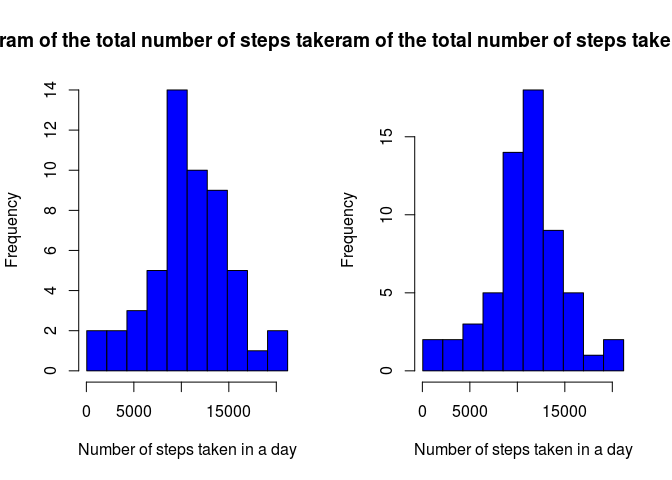

# Reproducible Research: Peer Assessment 1


```r
echo = TRUE
library(lattice)
```

### Loading and preprocessing the data


```r
#1. Code for reading in the dataset and/or processing the data
if (!exists('activity')) {
  if (!file.exists('activity.csv'))
    unzip('activity.zip')

  activity <- read.csv('activity.csv')
}
```

### What is mean total number of steps taken per day?

For this part of the assignment, you can ignore the missing values in the dataset.

```r
activity.completeCases <- activity[complete.cases(activity),]
```

1. Calculate the total number of steps taken per day

```r
activity.steps.totalByDay <- aggregate(activity.completeCases$steps,
                                       list(activity.completeCases$date),
                                       sum)
activity.steps.totalByDay <- setNames(activity.steps.totalByDay, c('date', 'steps'))
```

2. Make a histogram of the total number of steps taken each day

```r
#2. Histogram of the total number of steps taken each day
breaks <- seq(min(activity.steps.totalByDay$steps),
              max(activity.steps.totalByDay$steps),
              length=11)
hist(activity.steps.totalByDay$steps,
     freq   = T,
     breaks = breaks,
     col    = 'blue',
     main   = 'Histogram of the total number of steps taken each day',
     xlab   = 'Number of steps taken in a day')
```

\

3. Calculate and report the mean and median of the total number of steps taken per day

```r
#3. Mean and median number of steps taken each day
mean(activity.steps.totalByDay$steps)
```

```
## [1] 10766.19
```

```r
median(activity.steps.totalByDay$steps)
```

```
## [1] 10765
```

### What is the average daily activity pattern?

1. Make a time series plot (i.e. `type = "l"`) of the 5-minute interval (x-axis) and the average number of steps taken, averaged across all days (y-axis)

```r
#4. Time series plot of the average number of steps taken
activity.steps.average <- aggregate(activity.completeCases$steps,
                                    list(activity.completeCases$interval),
                                    mean)
activity.steps.average <- setNames(activity.steps.average, c('interval', 'average'))

plot(activity.steps.average$interval,
     activity.steps.average$average,
     type = 'l',
     col  = 'blue',
     main = 'Average daily activity',
     xlab = '5-minute interval',
     ylab = 'Average number of steps taken')
```

\

2. Which 5-minute interval, on average across all the days in the dataset, contains the maximum number of steps?

```r
#5. The 5-minute interval that, on average, contains the maximum number of steps
activity.steps.average[activity.steps.average$average == max(activity.steps.average$average),]
```

```
##     interval  average
## 104      835 206.1698
```

### Imputing missing values

1. Calculate and report the total number of missing values in the dataset (i.e. the total number of rows with `NA`s)

```r
nrow(activity[!complete.cases(activity),])
```

```
## [1] 2304
```

2. Devise a strategy for filling in all of the missing values in the dataset. The strategy does not need to be sophisticated. For example, you could use the mean/median for that day, or the mean for that 5-minute interval, etc.

The strategy that I used here was to fill the missing values with the average number of steps taken, averaged across all days.

3. Create a new dataset that is equal to the original dataset but with the missing data filled in.

```r
#6. Code to describe and show a strategy for imputing missing data
activity.naFilled <- activity
for (i in 1:nrow(activity.naFilled)) {
    if (is.na(activity.naFilled$steps[i])) {
        activity.naFilled$steps[i] <-
          activity.steps.average[which(activity.naFilled$interval[i] == activity.steps.average$interval),]$average
    }
}

nrow(activity.naFilled[!complete.cases(activity.naFilled),])
```

```
## [1] 0
```

4. Make a histogram of the total number of steps taken each day and Calculate and report the **mean** and **median** total number of steps taken per day. Do these values differ from the estimates from the first part of the assignment? What is the impact of imputing missing data on the estimates of the total daily number of steps?

```r
#7. Histogram of the total number of steps taken each day after missing values are imputed
activity.naFilled.steps.totalByDay <- aggregate(activity.naFilled$steps,
                                                list(activity.naFilled$date),
                                                sum)
activity.naFilled.steps.totalByDay <- setNames(activity.naFilled.steps.totalByDay,
                                               c('date', 'steps'))

par(mfrow = c(1,2))

hist(activity.steps.totalByDay$steps,
     freq   = T,
     breaks = breaks,
     col    = 'blue',
     main   = 'Histogram of the total number of steps taken each day',
     xlab   = 'Number of steps taken in a day')

breaks <- seq(min(activity.naFilled.steps.totalByDay$steps),
              max(activity.naFilled.steps.totalByDay$steps),
              length=11)
hist(activity.naFilled.steps.totalByDay$steps,
     freq   = T,
     breaks = breaks,
     col    = 'blue',
     main   = 'Histogram of the total number of steps taken each day',
     xlab   = 'Number of steps taken in a day')
```

\

```r
mean(activity.naFilled.steps.totalByDay$steps)
```

```
## [1] 10766.19
```

```r
median(activity.naFilled.steps.totalByDay$steps)
```

```
## [1] 10766.19
```

After imputting the missing data, the mean remains the same, but the median is greater then that calculated after removing the missing values.

### Are there differences in activity patterns between weekdays and weekends?

1. Create a new factor variable in the dataset with two levels – “weekday” and “weekend” indicating whether a given date is a weekday or weekend day.

```r
activity.naFilled$weekdays <- weekdays(as.Date(activity.naFilled$date)) == 'sábado' |
                              weekdays(as.Date(activity.naFilled$date)) == 'domingo'
activity.naFilled$weekdays <- factor(activity.naFilled$weekdays,
                                     levels = c(F, T),
                                     labels = c('weekday', 'weekend'))
```

2. Make a panel plot containing a time series plot (i.e. type = "l") of the 5-minute interval (x-axis) and the average number of steps taken, averaged across all weekday days or weekend days (y-axis). See the README file in the GitHub repository to see an example of what this plot should look like using simulated data.

```r
#8. Panel plot comparing the average number of steps taken per 5-minute interval across weekdays and weekends
activity.naFilled.steps.average <- aggregate(activity.naFilled$steps,
                                             list(activity.naFilled$interval,
                                                  activity.naFilled$weekdays),
                                             mean)
activity.naFilled.steps.average <- setNames(activity.naFilled.steps.average,
                                            c('interval', 'weekdays', 'average'))

xyplot(activity.naFilled.steps.average$average ~ activity.naFilled.steps.average$interval | activity.naFilled.steps.average$weekdays,
       layout = c(1, 2),
       type   = 'l',
       col    = 'blue',
       xlab   = 'Interval',
       ylab   = 'Number of steps')
```

\
